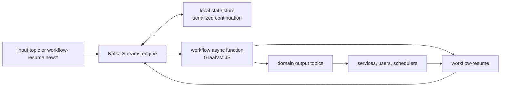

# Durable JavaScript workflows on Kafka

[](https://github.com/awto/kafka-workflow/actions/workflows/main.yml)

Kafka Workflow is a small workflow-as-code runtime for durable JavaScript and
TypeScript workflows on Kafka Streams.

Workflow code is normal `async` code. The difference is that an `await` can
wait for an external event for hours, days, or months while the continuation is
serialized into Kafka Streams state. There is no workflow DSL, no heavyweight
SDK surface, and no built-in policy engine for things that are better expressed
as application protocols.

Workflow scripts run on [Kafka Streams](https://kafka.apache.org/documentation/streams/) clusters. The runtime stores workflow continuations in the stream local state store and resumes them from an internal continuation topic, `workflow-resume`.

Kafka supplies the hard distributed-systems pieces: partitioning, recovery,
elastic stream processing, and durable logs. The workflow runtime stays small:
direct `async` code, durable refs, output records, workflow threads, and
cancellation-aware promise combinators. If Kafka is already part of the
platform, workflow execution can reuse the same brokers, topics, Streams
deployment model, monitoring, ACLs, retention policy, and operational tooling
instead of introducing a separate workflow cluster.

Kafka is the implementation substrate here, not the essence of the model. The
same approach can run on any stateless stream transformer that consumes a
durable log, joins each record with durable per-key state, and writes output
records. Kafka Streams is a practical host for that contract because many
systems already operate Kafka well.

The design rule is that domain policy should stay in workflow code. Sagas,
human approval, queries, updates, child workflows, delayed cleanup, and
versioning are examples, not runtime plugins. If a pattern can be expressed as
messages between durable workflow threads, it does not need a dedicated core
API.

## Why This Is Different

| Conventional workflow engines often add... | Kafka Workflow keeps it as... |
| --- | --- |
| Workflow-specific DSLs and handler registries | Plain TypeScript functions, loops, branches, and `await`. |
| YAML/JSON DAG definitions | Real code with types, lexical scope, imports, tests, and ordinary refactoring tools. |
| Graphical workflow designers | Source-controlled workflow code that can be reviewed, debugged, and changed like the rest of the application. |
| Heavy workflow-as-code runtimes | A small Kafka Streams host plus serialized JavaScript continuations. |
| Strict side-effect-free workflow definitions | Direct async code that emits records explicitly and keeps domain effects at protocol boundaries. |
| Activity, timer, signal, query, update, child-workflow, and versioning APIs | Durable refs, output records, workflow threads, and normal message protocols. |
| Framework-owned versioning and patch markers | Userland upgrade workflows and handoff envelopes, when the application needs them. |
| Runtime-level saga abstractions | Direct compensation callbacks written in workflow code. |
| Special cancellation scope APIs | Cancellation-aware `Promise.race`, `Promise.all`, `Promise.any`, and `Promise.allSettled`. |

The result is a small core that is easy to inspect and easy to replace. The
demos are not toy wrappers around hidden runtime features; they are the
patterns themselves, implemented as ordinary workflow code.

Declarative DAGs and visual workflow editors can be useful for small static
pipelines, but they often become a second programming language once real
business logic appears. YAML and JSON graphs tend to hide control flow in
configuration, make refactors mechanical and brittle, and produce diffs that
explain structure changes rather than intent. Graphical designs have a similar
problem: they look approachable at first, then become hard to review, merge,
test, and debug when the workflow is long-lived, versioned, or full of
exception paths. Kafka Workflow keeps the workflow in code so failures can be
understood with normal stack traces, tests, logs, and debugger sessions.

Some workflow-as-code systems improve on DAGs by letting users write real
programs, but then replace the graphical complexity with a large runtime model:
activity workers, special APIs, determinism rules, replay constraints, and
carefully separated side-effect-free workflow definitions. Those tradeoffs can
be valid, but they are still a framework to learn and obey. Kafka Workflow is
smaller: workflow code awaits durable refs, emits Kafka records, and keeps
side effects explicit at message boundaries chosen by the application.

## Small core

The runtime core does a small number of things:

- persists JavaScript continuations while workflow code is awaiting external
  events;
- resumes those continuations from `workflow-resume` records;
- emits output records from workflow code;
- starts durable workflow threads by key;
- propagates structured cancellation through workflow-aware promises.

The runtime deliberately does not own higher-level policy:

- no built-in versioning system;
- no built-in saga or compensation framework;
- no built-in query, signal, or update registry;
- no built-in workflow registry or deployment policy;
- no production scheduler;
- no domain-specific retry or timeout policy.

Those are normal workflow patterns. The demos show working versions, but
applications can replace them with protocols that fit their own domain.

The active JavaScript runtime is [src/main/js/packages/rt](src/main/js/packages/rt). The examples live under [src/main/js/demos](src/main/js/demos), starting with the minimal workflow at [src/main/js/demos/workflow-minimal/src/index.ts](src/main/js/demos/workflow-minimal/src/index.ts) and the primary saga at [src/main/js/demos/workflow-trip-booking-saga/src/index.ts](src/main/js/demos/workflow-trip-booking-saga/src/index.ts). The demo index is [src/main/js/demos/README.md](src/main/js/demos/README.md), including versioning demos, human approval, Docker Compose chaos tests, and a dedicated [Temporal comparison track](src/main/js/demos/temporal-ports/README.md).

## Run one demo locally

The fastest path to a passing workflow example is the minimal unit harness. It
builds one workflow bundle and runs one workflow test without starting Kafka or
Docker:

```sh
cd src/main/js
npm ci --ignore-scripts
npm test --workspace demos/workflow-minimal
```

After that, run the trip-booking saga when you want cancellation,
compensation, timers, and the full Kafka Streams engine/scheduler path:

```sh
npm test --workspace demos/workflow-trip-booking-saga
npm run test:integration --workspace demos/workflow-trip-booking-saga
```

## Architecture in one screen



`workflow-resume` is the internal loop. Domain topics stay explicit in
`manifest.outputTopics`, and external services resume workflows by writing a
record with the waiting ref id.

Typical use cases include:

  * Business Process Automation
  * Microservices Orchestration
  * Distributed Transactions
  * Infrastructure Provisioning
  * Monitoring and Polling
  * Data Pipelines

Workflow code stays direct:

```ts
export default async function tripBooking() {
  const compensations: Array<() => Promise<void>> = [];
  try {
    const car = await reserveCar();
    compensations.push(() => cancelCar(car));
    const hotel = await reserveHotel();
    compensations.push(() => cancelHotel(hotel));
    const flight = await reserveFlight();
    compensations.push(() => cancelFlight(flight));
    return { car, hotel, flight };
  } catch (e) {
    await Promise.all(compensations.map((run) => run()));
    throw e;
  }
}
```

## Versioning is just another workflow

Workflow versioning is intentionally not built into the runtime. The versioned
demos show one possible policy, implemented with the same primitives as any
other workflow:

- start messages use a versioned envelope with `workflow`, `version`, `kind`,
  `bookingId`, and payload fields;
- an upgrade manager is a normal workflow, `versioning-upgrade-manager`, that
  receives a command and emits ordinary upgrade-dispatch records;
- a running old workflow can hand off compatible state by writing a normal
  `versioning-handoff` record;
- the new workflow version adopts that handoff if the compatibility rule allows
  it;
- delayed release/cleanup is also just another workflow thread.

That is only an example protocol. Applications can use different envelope
shapes, version rules, upgrade triggers, registries, cleanup workflows, or no
central upgrade manager at all. The core runtime only persists continuations
and moves records; compatibility and rollout rules live in ordinary TypeScript
code chosen by the application.

The policy used by the demos is deliberately simple: major versions are
separate workflow families, minor versions can hand off compatible state, and
patch changes do not need an upgrade.

Concrete examples:

- [workflow-versioning-demo](src/main/js/demos/workflow-versioning-demo) is a
  tiny optional helper package for the demo envelope, version comparison,
  handoff records, and upgrade-manager workflow.
- [workflow-trip-booking-saga-versioned](src/main/js/demos/workflow-trip-booking-saga-versioned)
  shows `1.0 -> 1.1` handoff, `1.1.x` patch-only starts, a fresh incompatible
  `2.0` path, and delayed release.
- [workflow-ecommerce-versioned](src/main/js/demos/workflow-ecommerce-versioned)
  reuses the same helper to show that versioning policy is userland workflow
  code. Projects can keep this protocol, simplify it, or replace it entirely.

Kafka Workflow bundles debugger-instrumented JavaScript together with the workflow runtime and persists workflow state using [@effectful/serialization](https://github.com/awto/effectfuljs/tree/main/packages/serialization).

The Kafka Streams processor uses GraalVM JS to run the bundled JavaScript file. The bundle uses one debugger-instrumented code path; debugger transport can be disabled for headless runtime while keeping the code debuggable.

## Status and Usage

This project is still early, but the runtime is intentionally small and already
covers the core durable-workflow mechanics: persisted continuations, refs,
outputs, workflow threads, and cancellation-aware promise combinators. The repo
is also useful as a template for project-specific workflow engines.

There is also an alternative JVM implementation:
[javactrl-kafka](https://github.com/javactrl/javactrl-kafka).

Building currently requires JDK 17. That choice is mostly for code readability;
the Java host can be adapted to any earlier JDK version supported by Kafka
Streams.

To run a workflow, execute `org.js.effectful.kafka.workflow.Engine`. It expects
`workflow-resume` and the workflow output topics to already exist. The first
argument is a path to a built `.js` bundle. The optional second argument is a
properties file passed to Kafka Streams.

Examples also use a scheduler stream for delayed jobs. The included
`org.js.effectful.kafka.workflow.Scheduler` class is intentionally a demo
component, not a production scheduler. Production deployments should normally
use Quartz, a cloud scheduler, cron, broker-native scheduling, or another
project-specific scheduling service.

## Release Checklist

Before publishing the JavaScript runtime package, run the same layers that CI
uses plus the npm publish dry-run:

```sh
mvn -B package --file pom.xml
cd src/main/js
npm run test:integration
npm run test:integration:chaos
npm publish --dry-run --workspace packages/rt
npm whoami
npm publish --workspace packages/rt
```

`mvn package` installs Node, runs `npm ci --ignore-scripts`, builds the
workspace, runs all workspace unit tests, and runs the Java tests. The two
Docker Compose commands cover the real Kafka engine/scheduler demos, including
runner-kill recovery scenarios.

## How to write workflow scripts

A workflow script is a TypeScript/JavaScript module exporting a default function
or a named `main` function. The primary example in this repository is
[src/main/js/demos/workflow-trip-booking-saga/src/index.ts](src/main/js/demos/workflow-trip-booking-saga/src/index.ts).

Depend on `@effectful/kafka-workflow-rt` and bundle the workflow into a single
debugger-instrumented JavaScript file. Demos use the shared bootstrap
[src/main/js/demos/_build/bootstrap.ts](src/main/js/demos/_build/bootstrap.ts)
and the shared webpack factory
[src/main/js/demos/_build/webpack.config.js](src/main/js/demos/_build/webpack.config.js).
A demo config only declares its output bundle and any additional source folders
that must be instrumented.

Import the runtime library:

```ts
import * as W from "@effectful/kafka-workflow-rt";
```

### Core API in one screen

| API | What it does | Use it for |
| --- | --- | --- |
| `W.ref<T>(name?)` | Creates a unique awaitable external resume point. Awaiting it persists the continuation until a matching `workflow-resume` record arrives. | Waiting for activities, timers, human decisions, service replies, or any external event. |
| `W.refId<T>(id, key?)` | Creates an awaitable resume point with a caller-provided stable id and optional resume key. | Protocols where another workflow, scheduler, or caller must know the exact ref id ahead of time. |
| `W.outputJSON(value, topic, key?)` | Emits a Kafka record with `JSON.stringify(value)`. The key defaults to the current workflow thread id. | Commands to services, query replies, audit events, scheduler requests, and domain messages. |
| `W.ensureThread(value, key)` | Starts another workflow thread if that key has no existing state by emitting an internal `workflow-resume` init record. | Child workflows, service-style workflows, lock managers, upgrade managers, and delayed cleanup workflows. |
| `W.CancelToken` | Error thrown into canceled branches by workflow-aware `Promise` combinators. | Catch it at an external wait to emit domain-specific cancellation or cleanup, then rethrow unless cancellation is intentionally handled. |
| `export const manifest = { outputTopics }` | Declares external topics written by the bundle. Internal topics such as `workflow-resume` are filtered by the host. | Topic creation, host wiring, tests, and keeping workflow output contracts next to the workflow module. |

There is a dedicated `workflow-resume` topic for workflow continuations. It is
an internal loop topic and is filtered out of declared external output topics by
the host.

To start a new workflow, send a record to `workflow-resume` whose value starts
with `new:` and whose suffix is JSON passed to the workflow function. The record
key is the workflow thread id. Later resume records use the same key.

To output a record, use `W.output(value, topic, key?)`. The value is a string;
the optional key defaults to the current thread id. `W.outputJSON(value, topic,
key?)` is the JSON shortcut.

Declare external topics with an exported manifest:

```ts
export const manifest = {
  outputTopics: ["workflow-scheduler", "saga-reserve-car"]
};
```

`W.config.outputTopics` also exists for host/runtime defaults, but examples
prefer `manifest.outputTopics` because it keeps topic declarations next to the
workflow module.

The main waiting primitive is `W.ref(name)`. It returns an awaitable object representing an external resume point, and the whole program state can be persisted while awaiting it. Use `W.refId(id, key?)` when a workflow protocol needs a stable caller-provided ref id. There is also a lower-level `W.suspend(...)` helper, but normal workflow code should prefer refs.

Use `W.ensureThread(value, key)` when one workflow needs to start another
workflow thread only if that thread does not already exist. Child workflows,
service-style workflows, and the versioning demos are all built on this kind of
ordinary thread handoff.

The suspended program resumes when `workflow-resume` receives a record with the
current thread key and a JSON value with a `ref` field equal to the current
`W.ref(...)` id.

If the JSON has an `error` field, the awaiting code receives an exception.
Otherwise, the JSON `value` field becomes the result of the `await`.

The program can suspend in many points simultaneously. And, like usual JavaScript, it can use `Promise.all`/`Promise.race`. 

So if we have a code like this:

```ts
const car = await reserveCar();
const hotel = await reserveHotel();
```

and we want to start the reservation of a hotel immediately without waiting for a car we can change the code to:

```ts
const [car, hotel] = await Promise.all([reserveCar(), reserveHotel()]);
```

The runtime installs a workflow-aware `Promise` implementation, so `Promise.all`, `Promise.race`, `Promise.any`, and `Promise.allSettled` preserve workflow suspension and cancellation semantics across persisted steps.

## Cancellation

Cancellation is structured. When a workflow-aware combinator such as `Promise.race` or `Promise.all` decides that sibling branches should stop, the currently blocked `await` expression in those branches throws `W.CancelToken`. That does not cancel a running external job by itself, but the waiting branch can catch the token and emit a domain-specific cancellation command.

For example:

```ts
async function timeout(ms: number) {
  const resume = W.ref("scheduler");
  W.output(`${ms}`, "workflow-scheduler", resume.key);
  try {
    await resume;
  } catch (e: any) {
    if (e instanceof W.CancelToken)
      W.output("0", "workflow-scheduler", resume.key);
    throw e;
  }
  throw "timeout";
}
```

Here, we write `"0"` to the same scheduler key to cancel a previously scheduled job.

`Promise.all` and `Promise.race` are adapted for workflow cancellation. If any
argument of `Promise.all` rejects, the implementation cancels the other not-yet
settled values. After `Promise.race` settles, the losing branches are canceled.

Cancellation is essential to avoid some concurrency bugs.

Say, in this example:

```ts
try {
  await Promise.race([
    (async () => {
      await timeout(100);
      throw new Error("timeout");
    })(),
    (async () => {
      const hotel = await reserveHotel();
      compensations.push(() => cancelHotel(hotel));
    })()
  ]);
} catch (e) {
  await Promise.all(compensations.map((run) => run()));
}
```

Suppose the timeout arrives before `reserveHotel` returns the value. In that case, it won't be canceled because the `catch` there will be executed before `compensations.push` is run, so it will be an empty array.

The runtime uses cancellation-aware `Promise.race`, `Promise.all`, `Promise.any`, and `Promise.allSettled` semantics built into its patched `Promise` implementation.

## Flexible userland patterns

The runtime deliberately does not grow a special API for every workflow pattern.
The demos show how to build those patterns from the same small primitives:

- Sagas are normal code with a compensation stack; see
  [workflow-trip-booking-saga](src/main/js/demos/workflow-trip-booking-saga)
  and [saga](src/main/js/demos/temporal-ports/saga).
- Human approval is a normal `Promise.race` between approval refs and scheduler
  refs; see
  [workflow-expense-approval](src/main/js/demos/workflow-expense-approval).
- Child workflows are ordinary workflow threads started with
  `W.ensureThread(...)`; see
  [child-workflows](src/main/js/demos/temporal-ports/child-workflows).
- Queries, signals, and updates are ordinary messages handled by a serialized
  workflow loop; see
  [message-introduction](src/main/js/demos/temporal-ports/message-introduction)
  and [safe-message-handlers](src/main/js/demos/temporal-ports/safe-message-handlers).
- Versioning is ordinary workflow code. The demos use envelopes,
  upgrade-manager workflows, handoff messages, and delayed-release workflows,
  but applications can define a different protocol; see
  [workflow-trip-booking-saga-versioned](src/main/js/demos/workflow-trip-booking-saga-versioned)
  and [workflow-ecommerce-versioned](src/main/js/demos/workflow-ecommerce-versioned).

## Debugging

The workflow script is a usual async TS/JS program compiled through the Effectful debugger instrumentation. The demos use a single code path for debug and runtime execution. In headless Kafka/GraalJS runs, the debugger transport can be disabled without removing instrumentation, so the same workflow bundle can still be opened in the debugger when needed.

## Running multiple workflows

A bundle can export a dispatcher that selects a workflow by a field in the
start envelope. Several demos use this shape. For example, the versioned demos
route between business workflows, upgrade-manager workflows, and delayed-release
workflows in the same bundle without requiring runtime-level workflow registry
features.

---

## Scope and extension points

The current direction is to keep the runtime small and push policy into normal
workflow code. That is why the demos implement sagas, versioning, human approval,
queries, updates, child workflows, and delayed cleanup without adding dedicated
runtime APIs for those concepts.

Useful future extensions should follow the same rule:

- Better serialization formats can improve production storage efficiency, while
  the workflow API remains direct async code.
- Other runners can reuse the same contract when they provide a durable input
  log, per-key state, and explicit output records.
- Debugger integrations can improve the development loop without changing the
  runtime contract.
